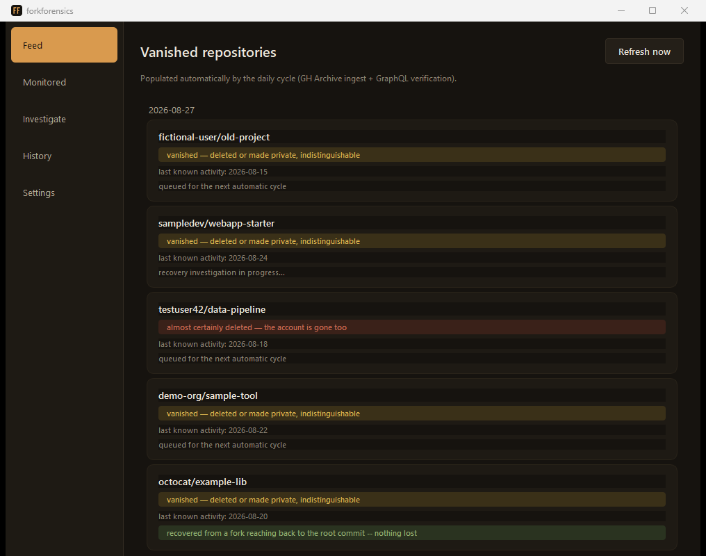

# ForkForensics


**A native desktop app that catches GitHub repositories the moment they
vanish, and tries to recover their history before it's gone for good.**

GitHub never tells you when a public repository gets deleted — it just
stops responding with a 404, exactly like one made private. ForkForensics
watches the repositories it has seen, notices when one goes silent, and
automatically searches forks and orphan commits for anything still
recoverable.



## Features

- **Automatic daily monitoring** — ingests GH Archive every night and
  bulk-rechecks the repositories that are due (up to 5,000 per cycle), no
  manual polling required.
- **Two independent recovery signals** — ranks forks by how far back their
  history reaches, and probes orphan commits that GitHub still serves by
  SHA even after they've become unreachable from any branch.
- **A watchlist for repos you actually care about** — add specific
  `owner/repo` entries that stay in the re-verification queue permanently,
  whether or not they ever reappear in public GitHub activity. They're
  rechecked on the same 14-day cadence as everything else.
- **Purely local recovery** — clones and rescues happen on your disk only;
  nothing gets pushed to GitHub and no repository gets created on your
  behalf.
- **Multi-token rotation** — configure more than one GitHub token and the
  app switches automatically before any of them hits its rate limit.
- **Desktop notifications** — runs quietly in the system tray and tells
  you what the nightly cycle found.
- **100% local** — your GitHub token and the database of monitored
  repositories stay on your computer. The only outbound requests go to
  GitHub (`api.github.com`, `raw.githubusercontent.com`, and `github.com`
  for git operations) and to `data.gharchive.org` for the public archive.
  No telemetry of any kind.

## Installation

Requires Python 3.11+ and Git.

```bash
git clone https://github.com/siris9476/forkforensics.git
cd forkforensics
python -m venv .venv
```

**Windows**

```bat
.venv\Scripts\pip install -r requirements.txt -r requirements-desktop.txt
.venv\Scripts\pythonw -m desktop.main
```

**macOS / Linux**

```bash
.venv/bin/pip install -r requirements.txt -r requirements-desktop.txt
.venv/bin/python -m desktop.main
```

On Windows, `pythonw` runs the app without a console window alongside it;
everything still goes to the log file. Use `python -m desktop.main` on any
platform to watch the log live in a terminal.

### First run

1. Open **Settings** and paste a GitHub token (or set the `GITHUB_TOKEN` /
   `GH_TOKEN` environment variable), then save.
2. Go to **Feed** and press **Refresh now** — the feed is empty until a
   cycle has run at least once. The automatic cycle then runs nightly at
   03:00 while the app is open.

**Token scopes:** a *classic* PAT needs **no scopes ticked at all** — the
tool only reads public repository metadata. A *fine-grained* PAT needs
"Public Repositories (read-only)" and no account permissions. The token is
required because GitHub's GraphQL API has no anonymous access, and it
raises the REST rate limit. You can enter multiple tokens separated by
commas; both the REST and GraphQL clients rotate between them
automatically as each approaches its limit.

**Where your data lives:** running from source, in `data/` next to the
repository. In the standalone executable, in `%APPDATA%\ForkForensics\` on
Windows (or your home directory elsewhere) — the log, the SQLite database
and downloaded archives all live there.

**Closing the window doesn't quit the app.** It minimizes to the system
tray so the nightly cycle can still run; quit from the tray menu or with
Ctrl+Q. On desktops with no system tray (common on GNOME/Wayland), closing
the window quits for real instead.

### Standalone executable

No Python installation required on the target machine. Build on the
platform you're targeting — PyInstaller does not cross-compile.

**Windows** (verified):

```bat
.venv\Scripts\pip install -r requirements-build.txt
.venv\Scripts\pyinstaller --name ForkForensics --onefile --windowed --icon desktop/resources/icon.ico ^
  --add-data "desktop/theme.qss;desktop" --add-data "desktop/resources/icon.ico;desktop/resources" ^
  --paths . desktop/main.py
```

The result is `dist/ForkForensics.exe`.

**macOS / Linux** (untested — note the `:` data separator instead of `;`,
and that macOS wants an `.icns` icon):

```bash
.venv/bin/pip install -r requirements-build.txt
.venv/bin/pyinstaller --name ForkForensics --onefile --windowed \
  --add-data "desktop/theme.qss:desktop" \
  --add-data "desktop/resources/icon.ico:desktop/resources" \
  --paths . desktop/main.py
```

If the logo changes, regenerate the icon with
`python desktop/resources/make_icon.py` (requires Pillow, already in
`requirements-build.txt`).

## How it works

**Automatic daily cycle** (internal scheduler at 03:00, with a desktop
notification when it's done):

1. Downloads the previous day's hourly GH Archive files and extracts
   every repository seen in any public event.
2. Bulk-rechecks (via GraphQL, 100 at a time) the repositories due for
   verification — 14 days after last seen activity, up to 5,000 per cycle.
   Watchlist entries stay in this queue permanently instead of ageing out.
3. For each repository that's no longer resolvable, records a
   disappearance and automatically starts a recovery investigation. A
   repository whose status can't be determined (an API error, a partial
   GraphQL response) is left alone and retried next cycle — it is never
   recorded as a disappearance on the strength of a failed request.

**Recovery investigation**, for a given repository:

1. Recursively discovers its forks and ranks them by how far back their
   oldest commit reaches — a fork freezes history at the moment it was
   made, so the deepest fork is the best recovery candidate.
2. Probes candidate commit SHAs (from forks and from GH Archive push
   events) that are no longer reachable from any branch but that GitHub
   may still serve directly — verified through three independent signals:
   REST metadata, a raw file fetch, and a real `git fetch`.
3. Builds a report with the fork ranking, the orphan SHAs found alive, and
   a plain-language verdict on what's actually missing and what would fill
   it — not just raw dates and counts.

Everything above is also reachable manually from the **Investigate** tab,
for one-off checks on a specific repository.

## Background

This project grew out of manually recovering historical data for a
quantitative trading project, after a repository it depended on was
re-initialized and appeared to have lost years of history. The recovery
was done by hand: ranking forks by depth to find one that had preserved
the missing years, then tracking down orphan commits to close the
remaining gap. ForkForensics automates that process end to end.

As a validation test, the tool was later run against that same real case:
its fork ranking reproduced — automatically, with no hints given — the
exact same ranking that had been found by hand months earlier, deepest
fork first, down to correctly flagging the one fork that had itself since
gone. The exercise also surfaced and fixed a real bug: the fork-of-fork
recursion relied on `pushed_at > created_at`, but a fork's `pushed_at`
inherits its source's last-commit timestamp and can predate `created_at`
for a fork that was never touched again. It was fixed using `forks_count`,
which GitHub's API already provides.

Built with Claude (Anthropic) as a coding assistant, under direct human
direction and review at every step — including the live, real-token
end-to-end tests described above.

## Known limitations

Declared here rather than discovered the hard way:

- **Scale** — empirically, a single hour of GH Archive typically contains
  tens of thousands of unique repositories (40,000–72,000 across sampled
  hours, varying with time of day). The daily re-verification queue can
  exceed what one GitHub token can process in a day; configuring more
  tokens pushes that ceiling higher, but a very large monitored population
  still needs to be narrowed down.
- **Private vs. deleted** — indistinguishable from the outside by design;
  both are surfaced as an ambiguous "vanished" state rather than a false
  certainty.
- **Legacy ID → GraphQL node-id conversion** — verified empirically (see
  `tests/test_github_graphql.py`) but not guaranteed by GitHub for every
  repository.
- **Orphan commit survival** — how long GitHub keeps serving an
  unreachable commit is undocumented and not guaranteed; the tool reports
  what's true right now, not a lasting promise.

## Security notes

- **Your token is stored unencrypted** in the local SQLite database
  (`settings` table). The Settings field hides it from view after saving,
  but anyone able to read that file can read the token. On Windows it sits
  under your per-user `%APPDATA%`; on macOS/Linux the file is created with
  owner-only permissions. Use a token with the minimum scopes (see above),
  and [revoke it](https://github.com/settings/tokens) if the machine is
  shared or compromised.
- **The token is sent to GitHub only** — `api.github.com` and
  `raw.githubusercontent.com`. The GH Archive downloads are unauthenticated
  and never see it.
- **Nothing is ever pushed.** Recovery clones and rescues are local-only;
  the tool never creates a repository or writes to GitHub on your behalf.
- The monitored-repository database accumulates public metadata about
  third-party repositories (names, owners, commit authors of probed
  commits). It never leaves your machine, and `data/` is gitignored.

## Testing

```bat
.venv\Scripts\pip install -r requirements-dev.txt
.venv\Scripts\pytest
```

`requirements-dev.txt` pulls in the desktop requirements too — some tests
import PySide6.

230 tests, almost all running against mocks and synthetic fixtures with no
real network calls. `tests/test_rescue_integration.py` is the deliberate
exception: it runs a real `git` binary against a real local repository (no
network involved) to verify the recovery mechanism against actual git
behavior rather than a mocked subprocess.

## Public showcase page

`docs/index.html` is a static, backend-free presentation page meant for
GitHub Pages — enable it from the repository settings once this project is
published. It explains what the tool does and how to get it; it doesn't
replace the desktop app itself.

## License

[MIT](LICENSE) — see [SECURITY.md](SECURITY.md) for how the tool handles
your token and what it talks to over the network.
